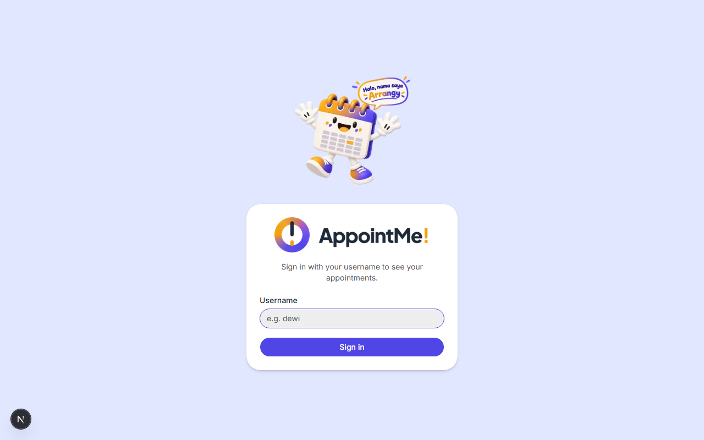
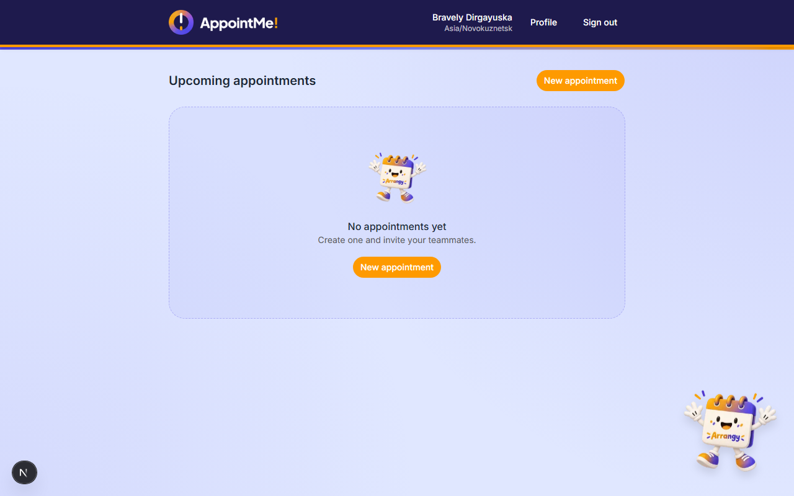
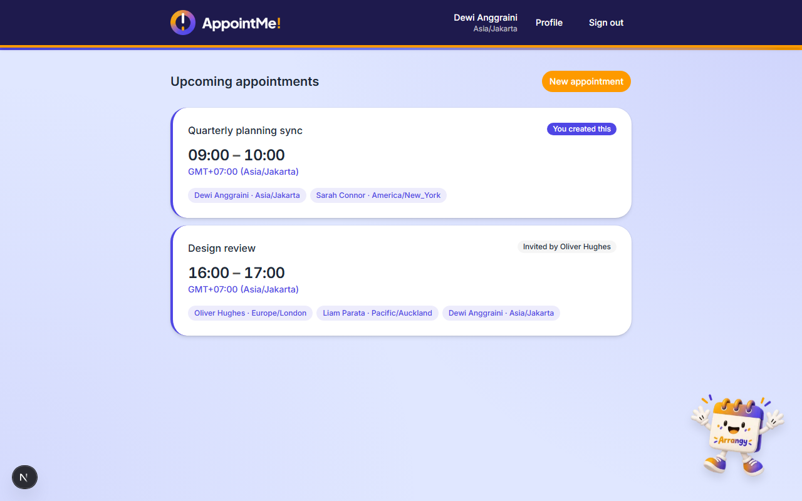
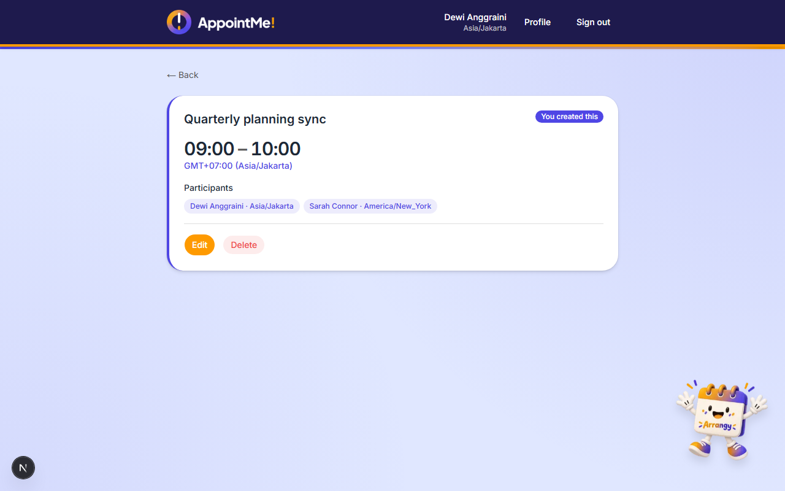
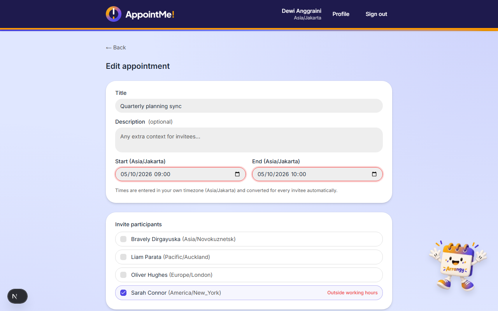
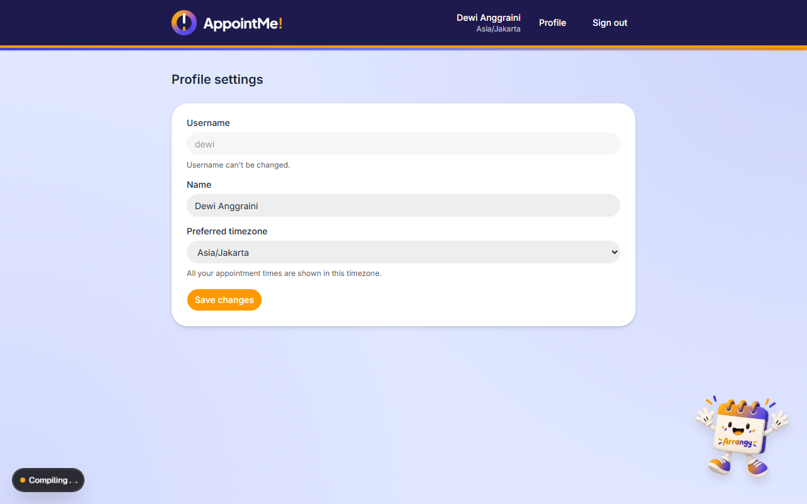

# AppointMe!

Aplikasi penjadwalan janji temu (appointment) yang sadar zona waktu (timezone-aware). User
login pakai username, atur zona waktu masing-masing, buat janji temu, dan undang user lain —
setiap jam yang tampil otomatis disesuaikan ke zona waktu orang yang sedang login, dan sebuah
janji temu hanya bisa dibuat kalau jamnya masih masuk jam kerja (08:00–17:00) untuk **semua**
orang yang terlibat, termasuk pembuatnya sendiri.

**Demo online (tanpa perlu install apa pun):** [appoint-me-psi.vercel.app](https://appoint-me-psi.vercel.app/)

**Video cara pakai:** [Google Drive](https://drive.google.com/file/d/1eFosK7GQtOc0F8MV6PggW1sGQ5L-pnv-/view?usp=sharing)

> Kalau cuma mau **lihat/coba aplikasinya**, buka saja link demo di atas — tidak perlu install
> apa pun di komputer. Panduan di bawah ini untuk yang mau menjalankan aplikasinya sendiri di
> komputer lokal (misalnya untuk mengecek kodenya).

## Screenshot

| | |
|---|---|
| Halaman login | Kalau belum ada janji temu |
|  |  |
| Daftar janji temu | Detail janji temu (sebagai pembuat) |
|  |  |
| Edit janji temu | Pengaturan profil |
|  |  |

---

## Cara menjalankan di komputer sendiri (langkah demi langkah)

Panduan ini ditulis dengan asumsi kamu **belum pernah** menjalankan project seperti ini
sebelumnya. Ikuti urutannya dari atas ke bawah, jangan ada yang dilompati.

### Yang perlu di-install dulu

Cuma butuh 2 program, install dulu sebelum lanjut ke bagian "Langkah-langkah":

1. **Node.js** — ini yang menjalankan kodenya.
   - Download dan install dari [nodejs.org](https://nodejs.org) (pilih versi **LTS**).
   - Project ini sebenarnya sudah "mengunci" versi Node yang dipakai (lewat file `.nvmrc` dan
     `package.json`) supaya semua orang pakai versi yang sama persis (**22.23.2**). Kalau kamu
     pakai [Volta](https://volta.sh) untuk mengelola versi Node, ini otomatis — tinggal masuk
     ke folder project-nya dan versi yang benar langsung aktif sendiri. Kalau tidak pakai
     Volta, versi Node LTS biasa juga aman dipakai.
2. **Docker Desktop** — ini yang menjalankan database (PostgreSQL) tanpa perlu install
   PostgreSQL secara manual.
   - Download dari [docker.com/products/docker-desktop](https://www.docker.com/products/docker-desktop/).
   - Setelah install, **buka aplikasi Docker Desktop-nya dan biarkan tetap terbuka/berjalan**
     di background — semua perintah `docker` di bawah ini butuh Docker Desktop aktif, kalau
     tidak akan muncul pesan error.

Kamu juga butuh **Terminal** (di Windows namanya "Command Prompt" atau "PowerShell", di
Mac/Linux namanya "Terminal") untuk mengetik perintah-perintah di bawah. Buka terminal, lalu
pindah ke folder tempat project ini disimpan (perintah `cd nama-folder`).

### Langkah-langkah

**1. Siapkan file konfigurasi (`.env`)**

Project ini butuh file bernama `.env` yang isinya rahasia/konfigurasi khusus komputer kamu
(alamat database, kunci keamanan). File contohnya sudah disediakan, tinggal disalin:

```bash
cp .env.example .env
```

Lalu buka file `.env` yang baru dibuat itu pakai text editor apa saja (Notepad juga boleh), dan
ganti nilai `JWT_SECRET` (yang isinya masih placeholder `replace-with-a-generated-random-secret`)
dengan kode acak. Cara paling gampang, jalankan perintah ini di terminal, lalu copy hasilnya ke
`.env`:

```bash
node -e "console.log(require('crypto').randomBytes(32).toString('base64'))"
```

> **Kenapa harus urutan ini dulu (bukan langsung `npm install`)?** Karena nanti di langkah 2,
> `npm install` otomatis menyiapkan koneksi ke database, dan itu butuh file `.env` ini sudah
> ada duluan — walau isinya belum tersambung ke database yang benar-benar hidup, filenya harus
> sudah ada.

**2. Install semua "bahan" yang dibutuhkan aplikasi**

```bash
npm install
```

Proses ini akan download banyak file pendukung (bisa makan waktu beberapa menit tergantung
koneksi internet) — tunggu saja sampai selesai. Kalau di akhir muncul tulisan
`added ### packages`, berarti berhasil.

**3. Nyalakan database (lewat Docker)**

```bash
docker compose up -d
```

Lalu cek apakah database-nya sudah benar-benar siap:

```bash
docker compose ps
```

Tunggu sampai kolom **STATUS** menunjukkan tulisan **healthy** (biasanya kurang dari 30 detik).
Kalau masih `starting`, jalankan lagi perintah `docker compose ps` beberapa detik kemudian.

**4. Siapkan struktur tabel di database**

```bash
npx prisma migrate deploy
```

**5. Isi database dengan data contoh** (5 akun user contoh + 2 janji temu contoh, supaya
aplikasinya tidak kosong melompong saat pertama dibuka)

```bash
npx prisma db seed
```

**6. Jalankan aplikasinya**

```bash
npm run dev
```

Tunggu sampai muncul tulisan semacam `Ready in ... ms`, lalu buka browser dan kunjungi:

**http://localhost:3000**

Kamu akan otomatis diarahkan ke halaman login.

### Kalau ada yang error / macet

- **`docker compose up` gagal / error soal port** — kemungkinan besar port `5433` di
  komputer kamu sudah dipakai program lain. Buka `docker-compose.yml`, ubah angka `5433` di
  bagian `"5433:5432"` jadi angka lain (misalnya `"5434:5432"`), lalu ubah juga angka yang sama
  di `DATABASE_URL` pada file `.env` supaya keduanya cocok.
- **Muncul error soal `DATABASE_URL` atau koneksi database saat `npm install` atau
  `npx prisma ...`** — cek lagi urutan langkahnya: file `.env` harus sudah ada (langkah 1)
  *sebelum* `npm install`, dan Docker Desktop harus sudah berjalan *sebelum* `docker compose up`.
- **Halaman muncul tapi kosong / error di browser** — coba tutup terminalnya (`Ctrl+C`), lalu
  jalankan ulang `npm run dev`.
- **Docker Desktop belum kebuka** — buka aplikasi Docker Desktop-nya dulu secara manual dari
  Start Menu / Applications, tunggu sampai ikonnya menunjukkan status berjalan, baru ulangi
  langkah 3.

## Akun untuk login (sudah tersedia dari langkah "isi database")

Login di aplikasi ini **cukup pakai username saja, tanpa password**. Pakai salah satu username
berikut untuk mencoba:

| Username | Zona waktu |
|---|---|
| `dewi` | Asia/Jakarta |
| `liam` | Pacific/Auckland |
| `oliver` | Europe/London |
| `sarah` | America/New_York |
| `bravely` | Asia/Jakarta |

Tidak ada fitur daftar akun baru sendiri (self-registration) — sesuai brief, form login hanya
punya kolom username, tidak ada tempat mengisi nama/zona waktu untuk akun baru. Kalau username
yang dimasukkan tidak ada di daftar di atas, login akan ditolak.

---

## Untuk yang lebih familiar dengan development

### Tech stack

| Layer | Pilihan |
|---|---|
| Framework | Next.js 16 (App Router), full-stack |
| Bahasa | TypeScript |
| Database | PostgreSQL 17 (lewat Docker) |
| ORM | Prisma 7.10.0 (driver adapter `@prisma/adapter-pg`) |
| Timezone / datetime | Luxon |
| Auth | JWT (payload minimal) di httpOnly cookie |
| Validasi | Zod |
| Styling | Tailwind CSS v4 + shadcn/ui |
| Testing | Vitest |

Arsitekturnya berlapis, satu arah saja: `app/api/*/route.ts` (controller, tipis) →
`lib/services/*` (business logic) → `lib/repositories/*` (query Prisma) → `lib/db.ts`
(satu-satunya file yang langsung menyentuh Prisma).

### Environment variables

| Variabel | Keterangan |
|---|---|
| `DATABASE_URL` | Connection string ke Postgres. Harus cocok dengan kredensial di `docker-compose.yml` dan port `5433`-nya. |
| `JWT_SECRET` | Secret untuk sign/verify JWT sesi login. Buat sendiri (lihat langkah 1 di atas) — jangan pernah pakai nilai placeholder di `.env.example` untuk hal yang serius. |

**Catatan soal port:** Postgres jalan di port host **5433**, bukan default 5432 — ini supaya
tidak bentrok dengan Postgres native yang mungkin sudah terpasang di sebagian komputer pada
port 5432.

### Menjalankan test

```bash
npm test
```

Meng-cover `lib/time.ts` (logika timezone/jam kerja) — konversi wall-clock↔UTC, perilaku DST
saat maju/mundur jam, validasi jam kerja lintas zona, dan koreksi terdokumentasi atas contoh
"Jakarta↔Auckland tidak overlap" dari brief (lihat `docs/ASSIGNMENT.md` bagian 5 dan
`docs/PROGRESS.md` untuk detail temuannya).

### Build untuk production

```bash
npm run build
npm start
```

### Struktur project

```
app/
  api/                  Route handler API (controller tipis)
  (protected)/           Route group: layout dengan pengecekan login + navbar
    appointments/        Halaman daftar + buat + edit + detail janji temu
    profile/              Pengaturan nama/timezone
  login/                Halaman login (publik)
lib/
  services/             Business logic
  repositories/         Query Prisma saja
  validators/           Skema Zod
  time.ts               Logika timezone/jam kerja murni (dipakai server maupun client)
  db.ts                 Singleton PrismaClient (satu-satunya file yang import Prisma)
components/             Komponen UI (primitif shadcn di components/ui/)
prisma/                 schema.prisma, migrations, seed.ts
docs/                   Catatan kerja internal: ASSIGNMENT.md, PROGRESS.md (log per fase)
screenshots/            Gambar-gambar untuk README ini
```

### Asumsi yang didokumentasikan

- **Jam kerja: 08:00–17:00.** Brief menyebut dua angka berbeda (09:00 di satu bagian, 08:00 di
  bagian lain); 08:00 dipilih karena lebih spesifik dan terlihat seperti nilai level-implementasi.
  Lihat `docs/ASSIGNMENT.md` bagian 5.
- **Sebuah janji temu tidak boleh melewati lebih dari satu hari kalender** di zona waktu
  siapa pun yang terlibat (ditolak sebagai error validasi, bukan dipotong diam-diam).
- **Zona waktu memakai nama zona IANA**, bukan offset UTC mentah, karena offset akan rusak
  begitu terjadi perubahan DST (musim panas/dingin).

Lihat `answers.md` untuk penjelasan lengkap soal penanganan konflik timezone, pilihan indexing
database, dan desain sesi login.
